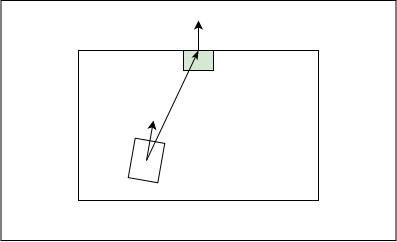
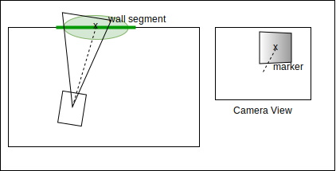

# Estimation of docking station position and orientation relative to robot.

## Context

This functionality should be seen as a part of a more complex skill of docking the robot to a docking station.
For an application such as hospital logistics, it useful to charge a robot's batteries in case they are nearing depletion.

At a task level the overall task of docking can be decomposed as follows:

1. Detecting the docking station.
2. Planning a trajectory towards the docking station.
3. Following this trajectory.

Specifically, the skill is related to the work of the following students.

- [Estimation of docking station position and orientation relative to robot](), by Christian Legaard
- [Detection of walls based on LIDAR point cloud](), by Daniella Tola.
- [Trajectory planning based on pose of docking station in relation to robot](), by Benedek

## Estimating docking station position

This report proposes a technique for estimating the position and orientation of a docking station relative to the robot. 
In this context the docking station is considered to be stationary, and having a fixed well known geometry.
Additionally, it is assumed to be placed directly besides a wall with a fiducial marker clearly indicating its pose.

The technique fuses information from several sensors in order to provide a more dynamic and more robust estimation.
Specifically it relies on the following techniques :
* Position and orientation estimation from vision based detection of marker.
* Mapping of walls based on LIDAR.
* Odometry.

The first technique is realized using vision based detection of the marker. Given that the maker is placed on a planar surface and has a well defined geometry, it is possible to calulate its position relative to the camera frame, see [subsection](#solving-homography) for details.
Some drawbacks of relying on this technique on its own is the procesing time, the fact that an algorithm may fail to detect the marker in some frames and the error caused by the quantization occuring when the image is captured.

To improve the accuracy of the estimate, the position and orientation of the wall behind the dock is exploited.
This allows the probability density function to be constrained to position along the wall, as seen in figure 2.

For control purposes the estimate needs to be updated frequently and periodic lack of updates must be addressed.
As such odometry is used to update the estimate between samples of the vision based estimation.

$$ x_{rd} = x_d - x_r $$
$$ \theta_{rd} = \theta_d - \theta_r $$

<figure>

<figcaption>Fig.1 - Relative position and orientation of robot and docking station</figcaption>
</figure>

<figure>

<figcaption>Fig.2 test</figcaption>
</figure>

## Algorithm

The update of the estimate is described in two parts, one related to odometry and one related to the vision based.
This is due to the fact that they occur at different rates.

### Odometry update:
For odometry based updates, the new estimate of the position $x_{rd}^+$, is based on the previous position $x_{rd}$, and the change in position experienced since last update $\Delta x_r$.
Updates to the orientation $\theta_{rd}^+$, are carried out in a similar fashion.

$$ x_{rd}^+ = x_{rd} + \Delta x_r $$
$$ \theta_{rd}^+ = \theta_{rd} + \Delta \theta_r$$

### Vision-based update:

When an image has been acquired, the image is pre-processed and an algorithm is applied to detect the specific type of marker.
If successful the homography may be solved to provide an estimate of the marker's relative position $\hat{x}_{rd}$, and orientation $\hat{\theta}_{rd}$.

Discard estimate if:
$$d(\hat{x}_{rd},w_n) > \beta_{wall} \forall w_n \in W$$

where W, is the set of all known walls, $d(...)$ is the shortest distance from a point to the closest point laying on the wall and $\beta_{wall}$ is a user defined threshold.

*Discussion: Instead of discarding this, the corrospondence between LIDAR and vision may be used to determine the degree of confidence for use in the Kalman filter*

The position is updated using a Kalman filter. The rule for updating the estimate $\hat x_t$, is:

$$ \hat x_t = \hat{x_t}' + K_t (z_t - \hat{x_t}') $$

Where $\hat{x_t}'$ is the predicted estimate, $K_t$ is the Kalman gain and $z_t$ is the innovation term.

*Discussion: May make sense drop odometry update as a separate update function, and instead integrate it into the kalman filter $A$ matrix*

**Parameters**

- $\beta_{wall}$ : threshold defining when an estimate of the marker position will be rejected based on its distance to a known wall.

## Assumptions

1. A docking station is **always** positioned next to a wall.
2. Docking station is stationary.
3. A straight line of sight between the robot's camera and docking station tag exists at all times
4. The dimensions and geometry of the docking marker is known.
5. Only one marker is within the field of vision of the robot.

## Inputs and Outputs
This section briefly describes the inputs and outputs of the functionality.

<figure>

<figcaption>Fig.3 test</figcaption>
</figure>

### Inputs
* $\Delta x_r$ : Change in relative position of robot since last update.
* $\Delta \theta_r$ : Change in orientation of robot since last update.
* $W$ : Set of identified walls, defined by their start and end points.
* $I$ : Image captured by camera.

### Outputs
* $x_{rd}$ : relative position of the robot.
* $\theta_{rd}$: relative difference of orientation between the robot and the docking station.

## Solving Homography
To be added if functionality is accepted.